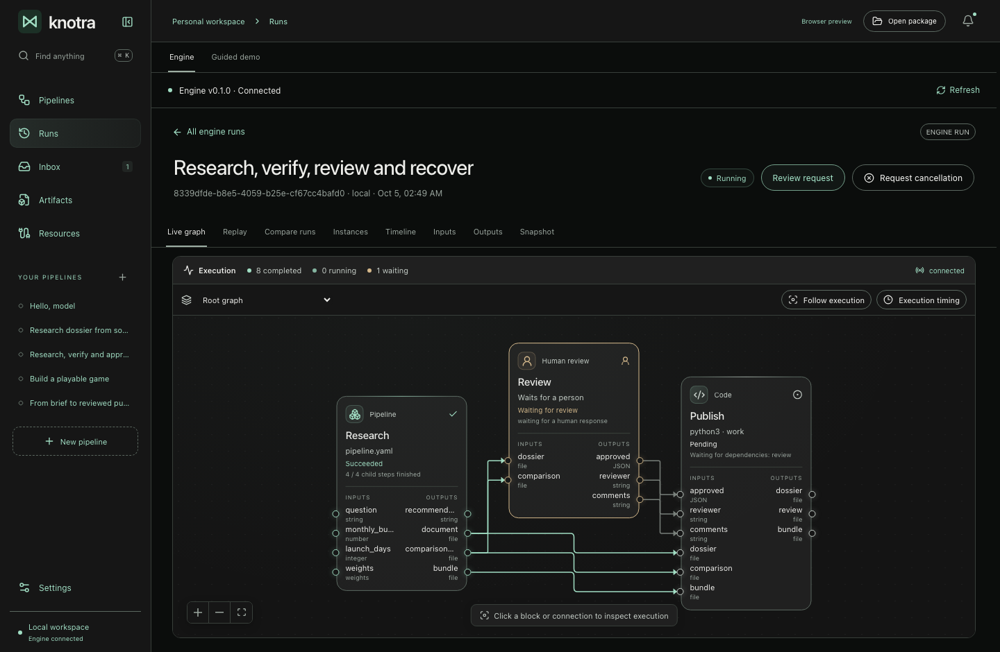
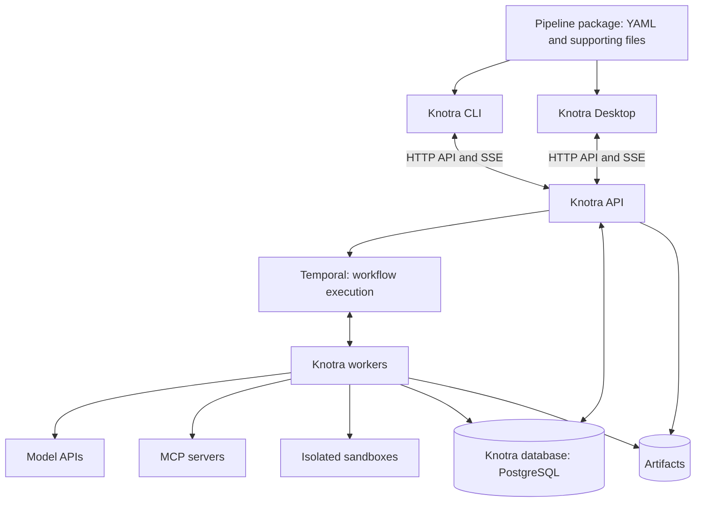

# Knotra

Knotra runs AI workflows for developers who need checked results, human approval and saved execution
history. Describe a process in YAML, run it through the CLI or desktop, inspect its evidence and
files, and approve the result. The engine preserves state across restarts.

The main example is **research → verification in code → human approval → dossier**. Agents extract
evidence from supplied materials; Python checks quotations and calculates scores. A reviewer
inspects the files before the engine publishes a ZIP with the approval record.
[Try the workflow](docs/first-run.md) · [Verification and limits](docs/verification.md).

[Watch the 2-minute recovery demo](docs/media/review-recovery.webm) — real local Ollama, Docker,
Temporal and PostgreSQL; review survives SIGKILL before publication.



## Features

Knotra v1 includes a YAML compiler, a Temporal-based engine, HTTP API, CLI, and desktop. The
contract supports nine node types: `llm`, `agent`, `code`, `tool`, `switch`, `human`, `foreach`,
`loop` and `pipeline`.

- Typed JSON data, files, CEL expressions, branching, and parallel graphs.
- Multiple independent runs simultaneously, including instances of the same package.
- Ollama, OpenAI Responses, and Anthropic Messages, an agent loop with explicit termination, MCP via
  Streamable HTTP and isolated stdio.
- Separate Docker environments, resource limits and network constraints, explicit grants of tools
  and secrets.
- Saved results, human responses, command receipts, limits, and resolution of unknown external
  operation outcomes.
- Live events via SSE, artifact retrieval, structured logs, and optional OpenTelemetry.

Models are configured in the engine profile; OpenAI and Anthropic keys are read from the server
environment. [Adapters](internal/adapters/README.md) describe parameters and limits. Desktop uses
the same HTTP API as CLI. [Desktop instructions](app/README.md) describe native run and preview.

## Quick Start

Install and run Docker (Colima works on macOS), Docker Compose, and Ollama. Download the
[CLI for macOS or Linux](https://github.com/michael-bill/knotra/releases/latest), unpack the
archive, and execute from its directory:

```sh
./knotra doctor
./knotra quickstart
```

Go and separate PostgreSQL/Temporal installation are not needed: the archive contains CLI and Linux
helpers for both Docker architectures. Quickstart starts persistent services, downloads `qwen3.5:9b`
if necessary, creates editable examples, and retrieves `greeting.txt`. First runs may take a while.
The command leaves the engine running and prints an address for desktop. Ctrl-C stops the engine;
repeating the same command reuses saved data and the original greeting run.

For building from source, Go from `go.mod` and Make are needed:

```sh
make build helper
bin/knotra quickstart --dir "$PWD/.knotra/quickstart"
```

Five [starter workflows](examples/starter/README.md) are available in the app. Start with **Hello,
model**, then open **Research, verify and approve**.
[First run and recovery demonstration](docs/first-run.md) take you through one small process;
[pilot plan](docs/pilot.md) helps verify usefulness on five developers.

[Settings and cloud profiles](docs/running.md) include connecting existing services, secrets, and
recovery. [CLI help](internal/cli/README.md) describes commands and exit codes. Compose quickstart
is intended for development and evaluation on a single machine.

## Development

```sh
make test
make check
```

Regular tests do not require Ollama, Docker, Temporal, or PostgreSQL. Checks of real services are
enabled explicitly via environment variables; [contribution guide](CONTRIBUTING.md) describes how to
run them. When working with your own DB, tests create and delete only their own temporary schemas.

## Architecture



The diagram shows main connections. Temporal additionally uses its own persistent storage, separate
from the Knotra database.

## Technology Stack

| Area                              | Solution                                                 |
| --------------------------------- | -------------------------------------------------------- |
| Engine and executors              | Go                                                       |
| CLI                               | Go + Cobra                                               |
| Desktop                           | Tauri 2 + Rust + React/TypeScript; SQLite for local data |
| Notation and data contracts       | YAML 1.2 + JSON Schema                                   |
| Conditions and simple expressions | CEL                                                      |
| Reliable execution                | Temporal + Go SDK                                        |
| API                               | HTTP/JSON + OpenAPI; SSE for events                      |
| Knotra data                       | PostgreSQL + pgx                                         |
| Models                            | Provider adapters                                        |
| MCP                               | Official Go SDK                                          |
| Environments                      | Docker via Engine API                                    |
| Artifacts                         | File storage initially; S3 adapter later                 |
| Diagnostics                       | Structured logs + OpenTelemetry                          |
| Single-machine deployment         | Docker Compose                                           |

CLI and server are built into one executable `knotra`. Linux helper for sandbox is built separately
for the Docker daemon architecture. Temporal and PostgreSQL preserve state; the engine data
directory preserves artifacts and large payload histories.

## Documentation

| Document                                             | Content                                                                      |
| ---------------------------------------------------- | ---------------------------------------------------------------------------- |
| [Product Vision](docs/vision.md)                     | Purpose, scenarios, principles and project boundaries                        |
| [Architecture](docs/architecture.md)                 | Components, execution, storage, isolation and recovery                       |
| [Notation](docs/notation.md)                         | Navigation through the full YAML v1 contract                                 |
| [Contract v1](docs/notation/v1.md)                   | All fields, ports, bindings and nine node types                              |
| [Execution](docs/notation/execution.md)              | States, branching, loops, files, repetitions and recovery                    |
| [Engine Profile](docs/notation/engine-profile.md)    | Connections, secrets, sandbox, permissions and limits                        |
| [Contract Validation](docs/notation/validation.md)   | Package, YAML/CEL, semantic rules and diagnostics                            |
| [JSON Schema](schemas/knotra-v1.schema.json)         | Machine-readable schema for Pipeline and EngineProfile                       |
| [Contract Fixtures](contracts/v1/fixtures/README.md) | Positive and negative cases; reproducible validation                         |
| [Technology Stack](docs/technology-stack.md)         | Selected technologies, their role and trade-offs                             |
| [Startup and Recovery](docs/running.md)              | Environment preparation, storage, settings and operational boundaries        |
| [Implementation Checks](docs/verification.md)        | Reproducible integration scenarios and validation boundaries                 |
| [Desktop](app/README.md)                             | Installation, engine connection and interface checks                         |
| [HTTP API](docs/api/desktop-v1.md)                   | Common CLI and desktop protocol; [OpenAPI](docs/api/desktop-v1.openapi.json) |
| [Temporal](docs/temporal.md)                         | History, large data, Continue-As-New and durable timers                      |
| [Development Phases](docs/roadmap.md)                | First useful version, checks and open solutions                              |

Vision and stack record agreed principles. The structural JSON Schema is supplemented by a semantic
compiler and resource availability checks upon startup acceptance.

In implementation, we maintain separation of source loading, validation, compilation of the
immutable plan and execution; shared constructs follow consistent rules. Quality criteria are
described in
[implementation rules](docs/notation/validation.md#9-implementation-boundaries-and-code-clarity).

## Participation and License

The project is distributed under the [MIT](LICENSE) license. Bug reports and suggestions are
submitted via Issues; changes — via pull request following [contribution guide](CONTRIBUTING.md).
For vulnerability reports see [SECURITY](SECURITY.md), for communication —
[CODE_OF_CONDUCT](CODE_OF_CONDUCT.md).
