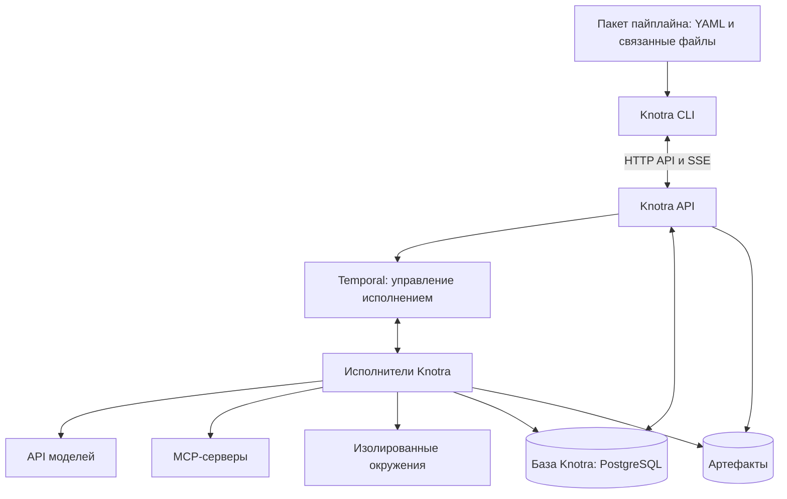

# Knotra

Knotra — система для описания и исполнения ИИ-пайплайнов. Пользователь задаёт процесс в YAML, движок выполняет связанные кубики, а CLI позволяет запускать процессы, наблюдать за ними и отвечать на запросы к человеку.

Пайплайн определяет порядок работы и передачу данных. Агент внутри своего кубика самостоятельно выбирает действия в пределах выданных инструментов, окружения и лимитов.

## Статус

Проект находится на этапе проектирования. Видение, архитектурное направление и технологический стек согласованы 29 сентября 2026 года. В репозитории пока только документация; движок, CLI и схема нотации ещё не реализованы.

Первый этап охватывает **нотацию, движок и CLI**. Desktop-приложение отложено. Будущие клиенты смогут использовать тот же API движка.

## Что будет уметь Knotra

- Описывать входы, выходы, связи, модели, промпты, инструменты и правила исполнения в YAML.
- Выполнять вызовы моделей, агентные задачи, код и инструменты; управлять ветвлением и параллельной работой.
- Подключать MCP-инструменты на уровне пайплайна и отдельных кубиков.
- Выдавать агентам изолированные окружения для файлов, Python и команд.
- Передавать между кубиками структурированные данные и сохранённые файлы.
- Сохранять историю, переживать перезапуски и поддерживать участие человека.
- Предоставлять CLI для проверки, запуска, наблюдения и получения результатов.

Это целевые возможности продукта. Их последовательность описана в [этапах разработки](docs/roadmap.md).

## Устройство

Схема показывает основные связи. Temporal дополнительно использует собственное постоянное хранилище, отделённое от базы Knotra.

## Технологический стек

| Область | Решение |
| --- | --- |
| Движок и исполнители | Go |
| CLI | Go + Cobra |
| Нотация и контракты данных | YAML 1.2 + JSON Schema |
| Условия и простые выражения | CEL |
| Надёжное исполнение | Temporal + Go SDK |
| API | HTTP/JSON + OpenAPI; SSE для событий |
| Данные Knotra | PostgreSQL + pgx |
| Модели | Адаптеры провайдеров |
| MCP | Официальный Go SDK |
| Окружения | Docker через Engine API |
| Артефакты | Файловое хранилище на первом этапе; адаптер S3 позднее |
| Диагностика | Структурированные логи + OpenTelemetry |
| Развёртывание на одной машине | Docker Compose |

CLI будет поставляться готовым исполняемым файлом. Полная система потребует работающего движка, Temporal, PostgreSQL и Docker. Команды установки и запуска появятся вместе с реализацией.

## Документация

| Документ | Содержание |
| --- | --- |
| [Видение продукта](docs/vision.md) | Назначение, сценарии, принципы и границы проекта |
| [Архитектура](docs/architecture.md) | Компоненты, исполнение, хранение, изоляция и восстановление |
| [Нотация](docs/notation.md) | Содержание пакета, типы кубиков и требования к контрактам |
| [Технологический стек](docs/technology-stack.md) | Выбранные технологии, их роль и компромиссы |
| [Этапы разработки](docs/roadmap.md) | Первая полезная версия, проверки и открытые решения |

Документы фиксируют согласованные принципы. Точные поля YAML, команды CLI, HTTP-маршруты и внутренние структуры будут определены следующими спецификациями.
