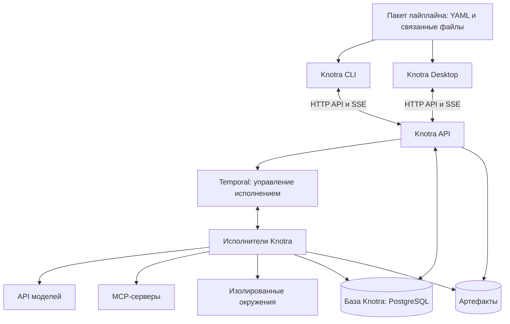

# Knotra

Knotra — система для описания и исполнения ИИ-пайплайнов. Пользователь задаёт процесс в YAML, движок
выполняет связанные кубики, desktop и CLI позволяют запускать процессы, наблюдать за ними и отвечать
на запросы к человеку.

Пайплайн определяет порядок работы и передачу данных. Агент внутри своего кубика самостоятельно
выбирает действия в пределах выданных инструментов, окружения и лимитов.

## Возможности

Knotra v1 включает компилятор YAML, движок на Temporal, HTTP API, CLI и desktop. Контракт
поддерживает девять типов кубиков: `llm`, `agent`, `code`, `tool`, `switch`, `human`, `foreach`,
`loop` и `pipeline`.

- Типизированные JSON-данные, файлы, CEL-выражения, ветвление и параллельные графы.
- Несколько независимых запусков одновременно, включая экземпляры одного пакета.
- Ollama, агентный цикл с явным завершением, MCP по Streamable HTTP и изолированному stdio.
- Отдельные Docker-окружения, ограничения ресурсов и сети, явная выдача инструментов и секретов.
- Сохранённые результаты, ответы человека, квитанции команд, лимиты и разрешение неизвестного исхода
  внешней операции.
- Наблюдение через SSE, получение артефактов, структурированные логи и опциональный OpenTelemetry.

Первый адаптер моделей — **Ollama**. Другие идентификаторы провайдеров отклоняются при подготовке
запуска. Docker backend и его сетевые гарантии описаны в
[документации адаптеров](internal/adapters/README.md). Desktop находится в `app/` и работает с тем
же движком через общий HTTP API. [Инструкции desktop](app/README.md) описывают нативный запуск и
browser preview.

## Быстрый старт

Нужны Go версии из `go.mod`, Docker (на macOS подходит Colima), Temporal, PostgreSQL и Ollama.
Команды выполняются из корня репозитория.

```sh
make build helper firewall
ollama pull qwen3.5:9b
docker pull python:3.13-alpine
export KNOTRA_DATABASE_URL='postgres://USER@127.0.0.1:5432/knotra?sslmode=disable'
bin/knotra serve --profile examples/local/profile.yaml
```

База `knotra` должна существовать; движок применяет версионированные миграции при старте. В другом
терминале:

```sh
bin/knotra validate examples/local/pipeline.yaml --profile examples/local/profile.yaml
bin/knotra run examples/local/pipeline.yaml --profile local --input 'name="Knotra"' --watch
bin/knotra runs list
bin/knotra artifacts list
```

[Развёртывание и настройки](docs/running.md) включают отдельную инфраструктуру Compose, подключение
существующих сервисов и восстановление. [Справка CLI](internal/cli/README.md) описывает команды,
файлы состояния и коды завершения. Отключение CLI не останавливает запуск; отмена — отдельная
команда.

## Разработка

```sh
make test
make check
```

Обычные тесты не требуют Ollama, Docker, Temporal или PostgreSQL. Проверки настоящих сервисов
включаются явно переменными окружения; [правила участия](CONTRIBUTING.md) описывают их запуск. При
работе с собственной БД тесты создают и удаляют только свои временные схемы.

## Устройство



Схема показывает основные связи. Temporal дополнительно использует собственное постоянное хранилище,
отделённое от базы Knotra.

## Технологический стек

| Область                       | Решение                                                        |
| ----------------------------- | -------------------------------------------------------------- |
| Движок и исполнители          | Go                                                             |
| CLI                           | Go + Cobra                                                     |
| Desktop                       | Tauri 2 + Rust + React/TypeScript; SQLite для локальных данных |
| Нотация и контракты данных    | YAML 1.2 + JSON Schema                                         |
| Условия и простые выражения   | CEL                                                            |
| Надёжное исполнение           | Temporal + Go SDK                                              |
| API                           | HTTP/JSON + OpenAPI; SSE для событий                           |
| Данные Knotra                 | PostgreSQL + pgx                                               |
| Модели                        | Адаптеры провайдеров                                           |
| MCP                           | Официальный Go SDK                                             |
| Окружения                     | Docker через Engine API                                        |
| Артефакты                     | Файловое хранилище на первом этапе; адаптер S3 позднее         |
| Диагностика                   | Структурированные логи + OpenTelemetry                         |
| Развёртывание на одной машине | Docker Compose                                                 |

CLI и сервер собираются в один исполняемый файл `knotra`. Linux helper для sandbox собирается
отдельно под архитектуру Docker daemon. Temporal и PostgreSQL сохраняют состояние; каталог данных
движка сохраняет артефакты и крупные payload истории.

## Документация

| Документ                                                 | Содержание                                                                |
| -------------------------------------------------------- | ------------------------------------------------------------------------- |
| [Видение продукта](docs/vision.md)                       | Назначение, сценарии, принципы и границы проекта                          |
| [Архитектура](docs/architecture.md)                      | Компоненты, исполнение, хранение, изоляция и восстановление               |
| [Нотация](docs/notation.md)                              | Навигация по полному контракту YAML v1                                    |
| [Контракт v1](docs/notation/v1.md)                       | Все поля, порты, привязки и девять типов кубиков                          |
| [Исполнение](docs/notation/execution.md)                 | Состояния, ветвление, циклы, файлы, повторы и восстановление              |
| [Профиль движка](docs/notation/engine-profile.md)        | Подключения, секреты, sandbox, права и лимиты                             |
| [Проверка контракта](docs/notation/validation.md)        | Пакет, YAML/CEL, семантические правила и диагностика                      |
| [JSON Schema](schemas/knotra-v1.schema.json)             | Машинная структурная схема Pipeline и EngineProfile                       |
| [Контрольные документы](contracts/v1/fixtures/README.md) | Положительные и отрицательные случаи; воспроизводимая проверка            |
| [Технологический стек](docs/technology-stack.md)         | Выбранные технологии, их роль и компромиссы                               |
| [Запуск и восстановление](docs/running.md)               | Подготовка окружения, хранение, настройки и эксплуатационные границы      |
| [Проверки реализации](docs/verification.md)              | Воспроизводимые интеграционные сценарии и границы проверок                |
| [Desktop](app/README.md)                                 | Установка, подключение движка и проверки интерфейса                       |
| [HTTP API](docs/api/desktop-v1.md)                       | Общий протокол CLI и desktop; [OpenAPI](docs/api/desktop-v1.openapi.json) |
| [Temporal](docs/temporal.md)                             | История, крупные данные, Continue-As-New и durable timers                 |
| [Этапы разработки](docs/roadmap.md)                      | Первая полезная версия, проверки и открытые решения                       |

Видение и стек фиксируют согласованные принципы. Структурная JSON Schema дополняется семантическим
компилятором и проверками доступности ресурсов при принятии запуска.

При реализации сохраняем разделение загрузки исходников, проверки, компиляции неизменяемого плана и
исполнения; общие конструкции имеют единые правила. Критерии качества описаны в
[правилах реализации](docs/notation/validation.md#9-границы-реализации-и-чистота-кода).

## Участие и лицензия

Проект распространяется по [MIT](LICENSE). Сообщения об ошибках и предложения оформляются через
Issues; изменения — через pull request по [правилам участия](CONTRIBUTING.md). Для сообщений об
уязвимостях см. [SECURITY](SECURITY.md), для общения — [CODE_OF_CONDUCT](CODE_OF_CONDUCT.md).
