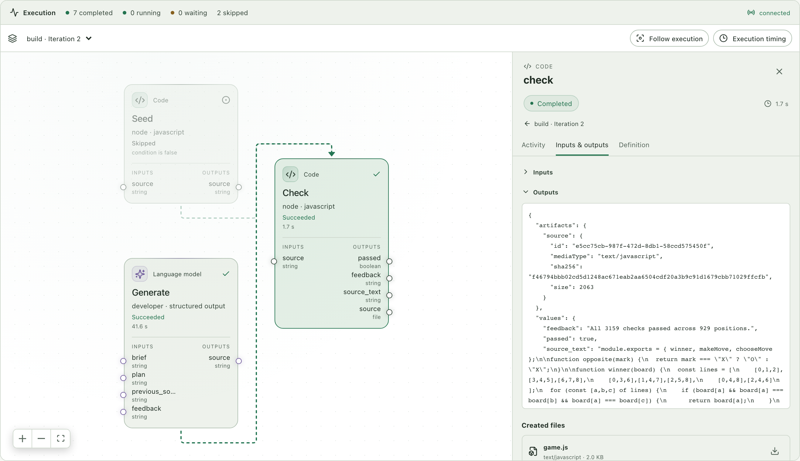
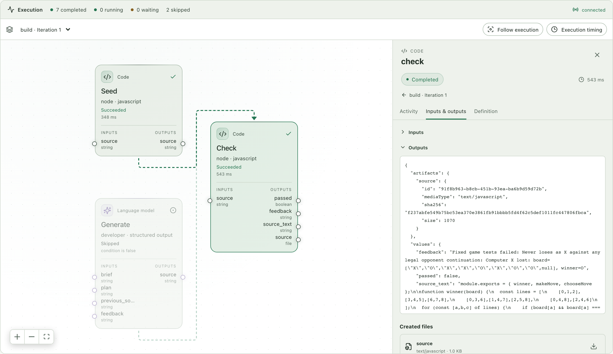
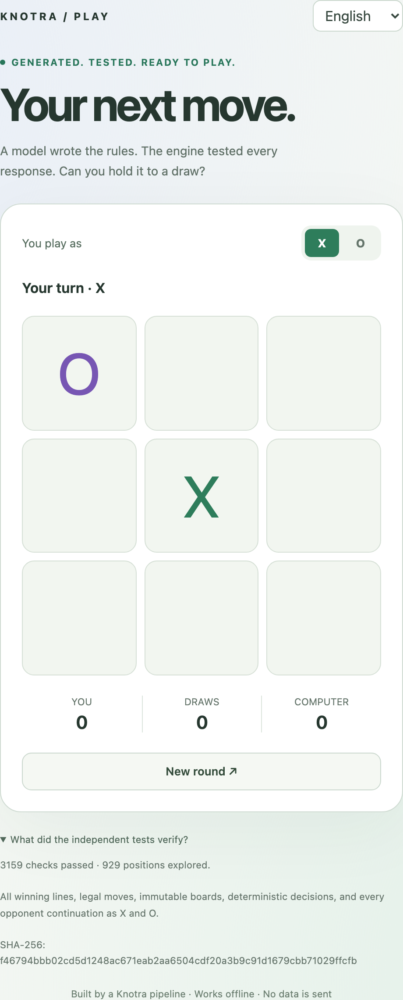
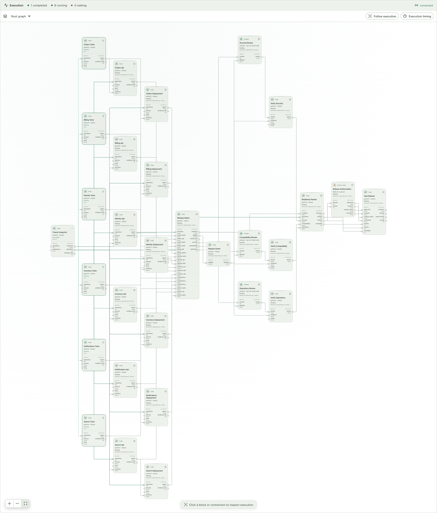
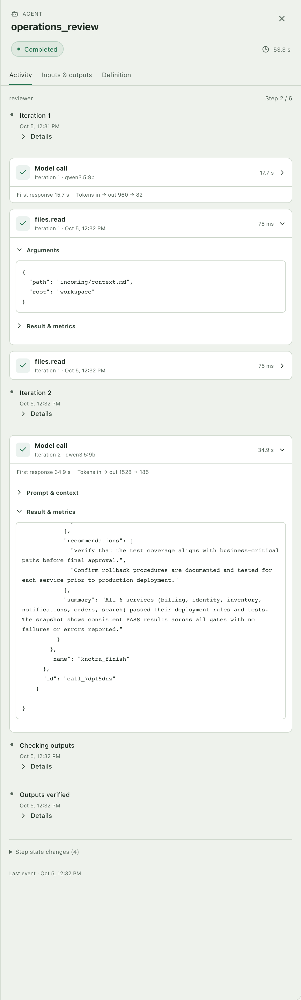
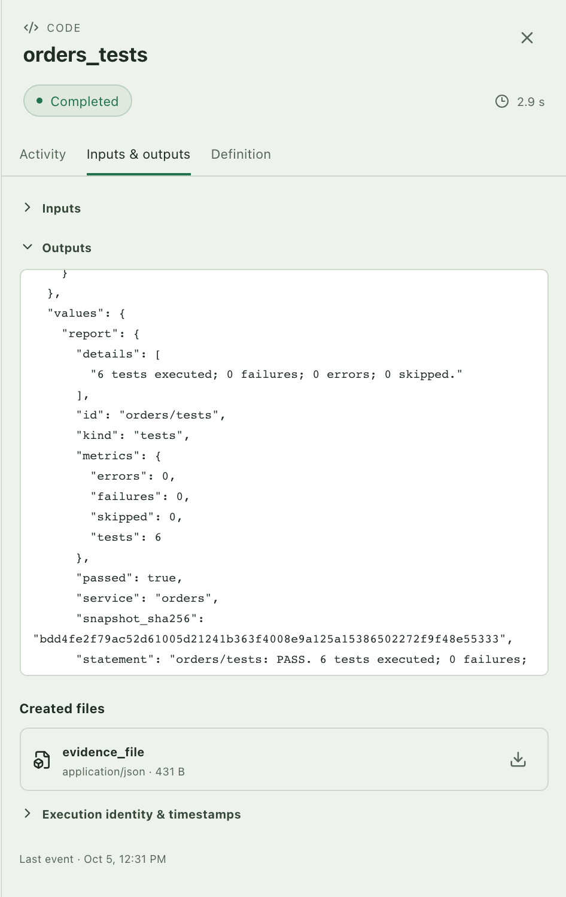
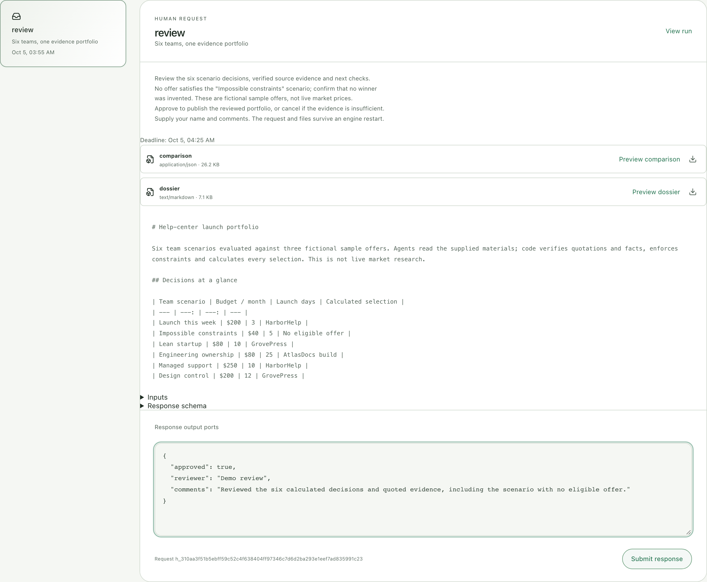
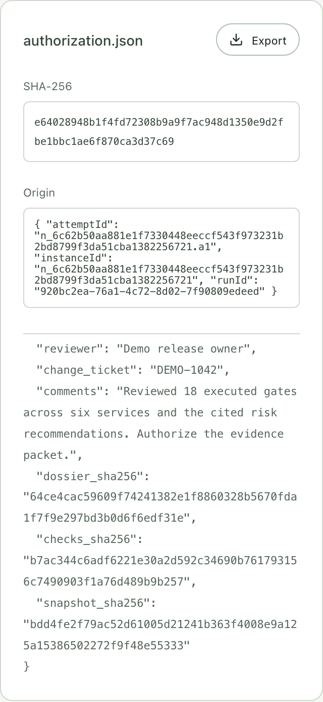
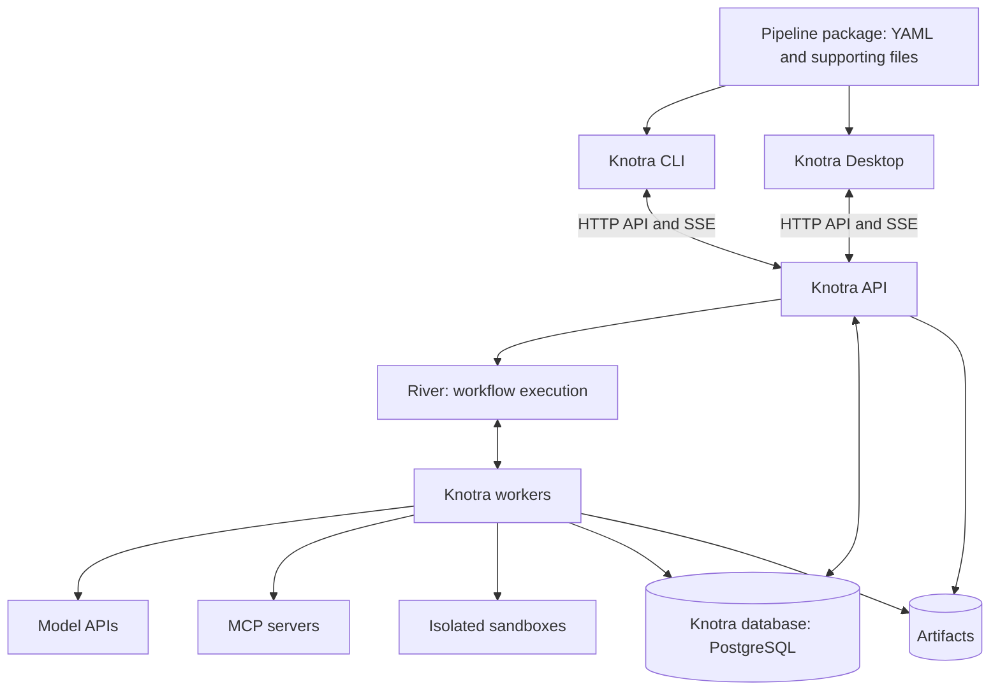

# Knotra

### AI workflows you can verify, inspect and resume.

Turn a task into a repeatable process: models do the reasoning, code checks the result, and people
approve the steps that need judgment. Knotra keeps the execution history and files across restarts.

[Quick start](#quick-start) · [See it run](#workflow-in-pictures) · [Documentation](#documentation)
· [Download CLI](https://github.com/michael-bill/knotra/releases/latest)

| Define the process                               | Verify the result                                          | Keep control                                                            |
| ------------------------------------------------ | ---------------------------------------------------------- | ----------------------------------------------------------------------- |
| YAML graphs, typed inputs and reusable packages. | Fixed tests, artifact checks and explicit pass/fail gates. | Inspect model calls and tools, set limits, and wait for human approval. |

Use it for code generation with test feedback, release evidence, reviewed research, and other tasks
that need several steps and an inspectable result. Start with a small game, then follow the larger
service release workflow below.

## Quick Start

Install Docker, Docker Compose and Ollama; Colima works on macOS. Unpack the
[CLI for macOS, Linux or Windows](https://github.com/michael-bill/knotra/releases/latest), then run:

```sh
./knotra doctor
./knotra quickstart --dir "$PWD/knotra-data"
```

On Windows, use Docker Desktop with Linux containers and the WSL 2 backend. Extract the Windows ZIP
for your architecture (amd64 or arm64), then run in PowerShell:

```powershell
.\knotra.exe doctor
.\knotra.exe quickstart --dir "$PWD\knotra-data"
```

Quickstart starts persistent PostgreSQL, prepares the local model and examples, and produces
`greeting.txt`. No Go installation is needed. First startup includes image/model downloads. Leave
the terminal running and connect desktop to the printed engine address. Repeating quickstart with
the same directory reuses saved data.

Then run the game in a second terminal:

```sh
./knotra run knotra-data/examples/tic-tac-toe/pipeline.yaml --profile local --wait
```

In PowerShell use `.\knotra.exe` in place of `./knotra` for these commands.

Use `artifacts list --run RUN_ID` and `artifacts download ARTIFACT_ID --output index.html` to
retrieve the game. Use your chosen directory if you changed `--dir`. [First run](docs/first-run.md)
explains inspection, correction and review.

Building from source instead:

```sh
make build helper
bin/knotra quickstart --dir "$PWD/.knotra/quickstart"
```

## Workflow in pictures

### Start small: build and repair a game

The [game workflow](examples/starter/tic-tac-toe/pipeline.yaml) generates JavaScript, runs fixed
independent tests and carries failures into a bounded correction loop. You can also supply an
existing module. The [repair exercise](examples/showcase/game-repair/README.md) deliberately starts
with an incorrect opponent: its first test fails, and the next iteration uses that exact failure to
repair it. A separate sandbox verifies the final code before producing a playable offline HTML file.



<details>
<summary>Inspect the initial failure</summary>



</details>

**Play the result.** The downloadable game includes the verified source and test report.

<details>
<summary>Open the playable result</summary>



</details>

### Apply it to a release process

The runnable [service fleet release gate](examples/showcase/release-gate/README.md) checks six
services through 30 nodes. It accepts an explicit repository snapshot and can generate lanes for
another service inventory. The supplied sample executes real tests; replace its services and check
adapters with your team's release inputs to run production experiments.

**Follow parallel work.** Six service lanes run regression tests, API compatibility checks and
configuration policy checks before the agents assess the verified results.



<details>
<summary>Inspect agents, executed checks, human approval and exported evidence</summary>

**Inspect the agent cycle.** A model requests the check evidence and release policy through
`files.read`, then returns structured recommendations through `knotra_finish`. Code verifies its
citations against the executed checks.



**Inspect executed checks.** Each service report records test counts, failures and the snapshot
hash. This run executed 36 regression tests and passed all 18 release gates.



**Authorize the evidence packet.** Inbox keeps the dossier and checks beside the review request. The
release owner supplies their name, change ticket and comments.



**Export the reviewed bytes.** The final ZIP contains the repository snapshot, executed checks,
agent recommendations, dossier and authorization record with SHA-256 hashes. Approval publishes the
reviewed packet.



</details>

## What you can build

- **Typed workflows:** nine node types — `llm`, `agent`, `code`, `tool`, `switch`, `human`,
  `foreach`, `loop`, `pipeline` — with parallel branches, nested iterations and JSON/file inputs.
- **Model and tool steps:** Ollama, OpenAI Responses, Anthropic Messages, and MCP through Streamable
  HTTP or isolated stdio. Profiles bind logical model names to providers.
- **Controlled execution:** Docker sandboxes, explicit tool/secret grants, network restrictions and
  run budgets.
- **Durable review:** saved human requests, completed results, command receipts and explicit
  handling of unknown external outcomes.
- **Inspection:** live graph and SSE events, model/tool activity, artifact export, history rewind
  and comparisons between runs.

The CLI and Tauri desktop use the same Go HTTP API. Five
[starter workflows](examples/starter/README.md) are bundled; larger showcases live in the
repository.

## Current scope

Knotra currently runs on one controlled host. Quickstart is for development and evaluation; shared
storage, authenticated multi-user approval, RBAC and retention policies remain further work.
[Verification](docs/verification.md) records the implementation checks.

## Architecture



River runs inside the engine process and stores its queue in the same PostgreSQL database. Temporal
is retained as an optional legacy backend for comparison tests.

The engine and CLI use Go; execution uses River, PostgreSQL and Docker. Desktop uses Tauri/Rust,
React/TypeScript, CodeMirror and React Flow. YAML and JSON Schema define the contract; CEL handles
expressions. See [architecture](docs/architecture.md) for storage, ownership and recovery.

## Documentation

| Start here                                           | Reference                                         |
| ---------------------------------------------------- | ------------------------------------------------- |
| [First run and examples](docs/first-run.md)          | [Pipeline notation](docs/notation.md)             |
| [Engine setup and providers](docs/running.md)        | [Engine profile](docs/notation/engine-profile.md) |
| [Desktop](app/README.md)                             | [CLI commands](internal/cli/README.md)            |
| [Verified behavior and limits](docs/verification.md) | [HTTP API](docs/api/desktop-v1.md)                |
| [Architecture](docs/architecture.md)                 | [Temporal implementation](docs/temporal.md)       |
| [Roadmap](docs/roadmap.md)                           | [JSON Schema](schemas/knotra-v1.schema.json)      |

## Contributing

```sh
make help
make format
make test
make check
make build
```

Default tests need no model weights or paid API keys. Real-service checks are opt-in; see
[CONTRIBUTING](CONTRIBUTING.md). Report bugs through Issues and submit changes through pull
requests. For vulnerabilities, follow [SECURITY](SECURITY.md).

[MIT](LICENSE) · [Code of conduct](CODE_OF_CONDUCT.md)
