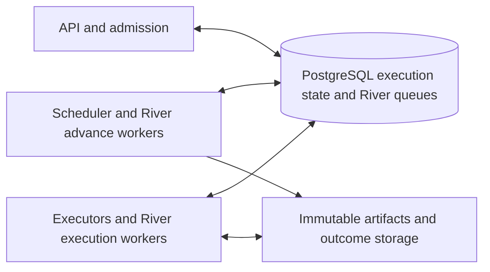

> MVP scope, updated 2026-10-06: ship a single-process River engine with PostgreSQL, sqlc, strict
> lint and Makefile commands. Cluster capabilities, separate process deployment, two-host acceptance
> and exhaustive performance gates are deferred. The detailed plan below remains a future roadmap,
> not the MVP release checklist.

# Knotra Scheduler and River Migration Plan

Replace Temporal with a Knotra scheduler that persists execution state in PostgreSQL and uses River
OSS to deliver work. The first release keeps the existing combined Go service and single host
deployment. A later stage enables multiple scheduler and executor processes against the same
database and shared artifact storage.

This is a proposed implementation plan, based on the repository and River documentation reviewed on
October 5, 2026. It does not describe functionality already implemented. The requested option
retains PostgreSQL; adding SQLite is separate work. The intended benefit is removing the Temporal
service, its history store and its deployment requirements while preserving the v1 execution
contract. Resource savings must be measured before release.

The project has not launched. Use one initial application schema and edit it directly; deployed
database upgrades and legacy-run conversion are outside the current scope. Temporal remains a
behavioral test baseline until retirement. River still initializes its own queue schema through its
library.

## Scope and release criteria

The migration preserves YAML v1, all nine node types, the HTTP and SSE contracts, CLI and desktop
behavior, immutable admitted plans, permissions, budgets, artifact publication and external
operation identity. Knotra will own graph progress, deadlines, human waits, cancellation and
recovery. River will own queue delivery and its maintenance.

The replacement is ready when:

- Every existing execution semantics scenario passes against the new scheduler.
- Process termination never repeats a confirmed external action or completed node.
- Unknown external outcomes remain explicit and obey the existing resolution policy.
- Database outages do not discard a durably captured result or extend an execution deadline.
- Restart restores nested graph positions, pending waits, counters and scheduled retries.
- River runs inside the Go service and requires only the existing PostgreSQL database.
- A subsequent cluster release passes the same guarantees with at least two worker hosts.

Arbitrary Go workflows, transparent recovery of lost agent workspaces, new YAML syntax, provider
switching, generalized storage adapters and a new operator UI are outside this migration. Existing
unknown outcome and request APIs provide the operator interaction.

## Current implementation and changes

| Area                | Current implementation                                              | Planned change                                                                     |
| ------------------- | ------------------------------------------------------------------- | ---------------------------------------------------------------------------------- |
| Run orchestration   | `internal/engine/workflow.go` and deterministic Temporal goroutines | Bounded scheduler steps over persisted execution records                           |
| Graph execution     | `graph.go` and `control.go` hold live graph and composite state     | Persist graph scopes, instances, foreach elements and loop positions               |
| Node attempts       | `leaf.go` invokes one execution activity with SDK retries disabled  | River delivers a guarded execution attempt                                         |
| Command delivery    | `Store.Command`, `PutRun`, `Enqueue` and Temporal outbox delivery   | New runs enqueue scheduler wakeups in their command transaction                    |
| State views         | `Store.Project` writes API projections and events                   | The transition transaction writes authoritative state and API views together       |
| External operations | Adapter hooks journal intent and results in PostgreSQL              | Retain identity and classification; add attempt ownership checks                   |
| Process ownership   | One advisory lock for the entire engine                             | Retain during initial rollout; later replace with worker and attempt ownership     |
| Large payloads      | Local Temporal codec blobs and local artifacts                      | New execution records and durable outcome blobs; shared artifacts for cluster mode |
| Recovery            | Temporal history plus PostgreSQL and data directory                 | PostgreSQL execution records plus immutable artifacts and outcome blobs            |

The API projections cannot become scheduler checkpoints by themselves. In
[`projections.go`](../internal/store/projections.go), inputs and outputs are bounded for
observation. They also omit control state required to continue nested execution. New authoritative
records must retain complete validated values independently of these views.

Sources for the compatibility baseline are [execution semantics](notation/execution.md),
[Temporal behavior](temporal.md), [architecture](architecture.md),
[store responsibilities](../internal/store/README.md) and [contribution rules](../CONTRIBUTING.md).

## Responsibility boundaries

| Component                  | Responsibility                                                                                                  |
| -------------------------- | --------------------------------------------------------------------------------------------------------------- |
| Knotra scheduler           | Readiness, bindings, branching, nested graphs, retries, deadlines, requests, cancellation and final run results |
| PostgreSQL execution store | Authoritative transitions, complete values, ownership, counters, command receipts and durable wakeups           |
| River OSS                  | Job insertion, delivery to workers, queue concurrency per process, infrastructure retries and queue maintenance |
| Knotra executor            | One admitted attempt using the existing model, MCP and Docker adapters                                          |
| Outcome store              | Durable handoff of a completed attempt result when its database transaction cannot yet commit                   |
| Artifact store             | Immutable bytes with checksum, origin and publication metadata                                                  |

River offers transactional job insertion and completion, which lets application transitions and
queue changes share a transaction. Use those APIs rather than enqueueing after commit.
[River transactional enqueueing](https://riverqueue.com/docs/transactional-enqueueing),
[River transactional completion](https://riverqueue.com/docs/transactional-job-completion).

The implementation uses OSS APIs only. River workflows and distributed concurrency limits are Pro
features. Knotra must implement its graph semantics and scope concurrency in its own records.
[River Pro feature boundaries](https://riverqueue.com/docs/pro).

These are process roles. The initial deployment runs them in one Go process; cluster deployment
separates them without changing the storage or execution contract.

### Package layout

Introduce `internal/execution` for domain records shared by the scheduler, store and executors:
attempt identity, results, failures, scope references and versioned durable state. Introduce
`internal/scheduler` for transition logic and `internal/queue` for River job types and handlers.
Extract the SDK independent execution host from `internal/app/server.go` into a small executor
module.

Keep the current `internal/engine` workflow available for legacy runs during migration. Avoid
changing its recorded command order when extracting common helpers. Share pure contract logic and
use explicit conversions or compatible aliases where needed. Run retained Temporal replay checks
after any legacy workflow refactor.

`internal/store` should depend on domain records rather than the new scheduler or River handlers.
The queue bridge composes store transactions, scheduler decisions and executor calls; `internal/app`
wires the components and manages process lifecycle. This removes the existing coupling where store
methods construct Temporal engine inputs, without creating an import cycle.

## Durable execution model

Use relational records for individually changing execution units. Avoid replacing Temporal history
with a single growing JSON snapshot rewritten after every event. Table and column names below are
proposed; finalize them with the first persistence implementation.

| Record                      | Required data and invariants                                                                                                                                                              |
| --------------------------- | ----------------------------------------------------------------------------------------------------------------------------------------------------------------------------------------- |
| Existing `knotra_runs`      | Immutable backend selection, scheduler and state format versions, durable admission time, root deadline, state revision, wake and applied generations, stop cause and cancellation state  |
| `knotra_execution_graphs`   | Stable graph instance ID, run and parent node IDs, immutable graph address, validated inputs, effective permissions and limits, deadline, complete exports and completion state           |
| `knotra_execution_nodes`    | Stable instance ID, graph and node address, contract state, complete admitted inputs and outputs, original deadline, current attempt number, dependency readiness and transition revision |
| `knotra_execution_attempts` | Unique run, instance and attempt number; dispatch generation; owner and ownership generation; lease expiry; state; result or failure reference; durable outcome key                       |
| `knotra_execution_controls` | Foreach item order and next materialization position; loop iteration and carry state; child graph identity; bounded expansion cursor                                                      |
| `knotra_execution_scopes`   | Materialized instance count and active attempt count for each effective budget scope                                                                                                      |
| `knotra_execution_slots`    | Unique attempt and scope reservations, released once on completion or reconciled worker loss                                                                                              |
| `knotra_execution_timers`   | Unique timer identity and generation, run and target, kind, absolute due time and consumed state                                                                                          |
| `knotra_workers`            | Process incarnation, host identity, supported execution versions and capabilities, heartbeat and draining state                                                                           |

Continue using existing commands, requests, operations, budgets, observations, events and artifact
metadata tables. Add ownership and version fields where required. Keep public identifiers and
response formats stable.

Add uniqueness constraints for graph addresses, node addresses, attempt numbers, timer generations
and slot reservations. Index runnable records, dirty runs, due timers and expired leases using their
actual query predicates. Audit foreign keys and retention together so queue cleanup cannot delete
execution evidence.

Every successful transition must save the authoritative record, allocate its event sequence, update
the public view and insert any required next job in the same transaction. Full outputs are durable
before downstream readiness changes. Artifact bytes must exist and pass integrity checks before
their publication metadata commits.

### Serialization and database time

Begin with one short row lock on the run for execution mutations. Lock subordinate records in a
documented, consistent order. Update budget reservations through the same ordering so command,
scheduler and executor transactions cannot deadlock through different lock sequences. Different runs
remain independent.

Capture database time after acquiring the relevant locks. Persist absolute deadlines once, and
compare them again before admitting an attempt or sending a physical external operation. Queue
delay, restart, retries and worker changes must not reset them. Tests should explicitly cover lock
waits that cross a deadline.

Do not perform model calls, Docker operations, blob uploads, plan preparation or other network work
while holding execution row locks. Load immutable inputs outside the critical section where safe,
then validate the relevant revision under the lock before committing a decision.

### Version policy

Persist scheduler semantic version and state format version at admission. A worker must understand
both before claiming work. Keep the existing compiler, CEL and adapter compatibility checks. Route
incompatible work to a compatible worker pool or leave it blocked with an actionable diagnostic.

Validate worker/state compatibility during execution and cluster replacement. There is no deployed
application schema to upgrade in this project; schema changes go directly into the initial schema.
Define a supported upgrade policy before a future deployment needs one.

## Scheduler algorithm and wakeups

The scheduler evaluates the frozen plan and persisted execution state using a bounded transition
step. Reuse the contract compiler, CEL evaluator, binding rules, permissions and stable instance
addressing. The step receives an explicit timestamp and returns proposed record changes, events and
jobs; it performs no external execution.

For each step:

1. Acquire the run lock and validate backend, version, cancellation and deadlines.
2. Read the affected graph scopes and complete persisted values.
3. Apply pending results, request decisions and due timer decisions once.
4. Resolve dependencies, `needs`, bindings and `when` in the existing admission order.
5. Commit control transitions or make leaf attempts eligible for dispatch.
6. Save changed state, event sequences, counters and job insertions together.
7. Complete the scheduler delivery transactionally; schedule another step if bounded work remains.

Bound each step by transition count and transaction duration. Persist materialization positions so a
large foreach or graph does not create thousands of rows in one transaction. Use a reverse
dependency index derived from the frozen plan to limit affected node scans. Preserve lexical order
where the current implementation depends on it; independent external completion order remains
unspecified by v1.

Every mutation that needs scheduling increments a durable `wake_generation`. An advance job carries
that generation. Under the lock it may consume all currently committed changes, records the applied
generation and inserts the next generation if more work remains. Stale deliveries become no-ops. A
periodic reconciler repairs dirty runs without a viable job by creating a new generation under the
same lock.

If a viable unconsumed advance already exists, it can carry later committed generations without
another queue row. Keep incrementing the domain counter and consume its latest value under the run
lock. A consumed delivery, dead owner, expired handler, malformed identity or future backoff cannot
suppress an immediate wake. Request commands still apply their domain transition inside their
receipt transaction regardless of queue coalescing.

Do not rely on one forever-unique job per run. River uniqueness depends on selected job states and
retention; completed jobs can suppress later insertions. Explicitly configure and test uniqueness
using run and generation for scheduler jobs, and attempt and dispatch generation for execution jobs.
Domain constraints remain authoritative after job retention expires.
[River uniqueness behavior](https://riverqueue.com/docs/unique-jobs).

### River jobs

| Job               | Arguments                                                                             | Retry policy and purpose                                                          |
| ----------------- | ------------------------------------------------------------------------------------- | --------------------------------------------------------------------------------- |
| Advance run       | Run ID, wake generation and routing version                                           | Idempotent infrastructure retries; executes a short scheduler step                |
| Execute attempt   | Run ID, instance ID, business attempt number, dispatch generation and routing version | `MaxAttempts: 1` initially; executor claims domain ownership before external work |
| Finalize outcome  | Attempt identity and outcome key                                                      | Idempotent retries; imports durable evidence and publishes an eligible result     |
| Cleanup resources | Worker or host identity, resource identity and ownership generation                   | Idempotent retries; removes only a verified abandoned resource                    |

Job arguments contain identities and version markers. Load the frozen plan and validated inputs from
Knotra storage; keep secrets, prompts, large results and packages out of queue arguments. A bounded
immutable plan cache can be added after measurement, keyed by admitted plan identity and execution
version.

Separate orchestration, execution and maintenance queues so slow model or sandbox work cannot
consume all scheduler capacity. Configure local River worker limits and database pool headroom;
admission and observation writes must remain possible under execution saturation.

Shutdown stops fetching jobs, allows a bounded drain period, then cancels active executor contexts.
It does not run global sandbox deletion. Interrupted attempts retain their ownership and evidence
until finalization or reconciliation decides their outcome.

Business failures are persisted as execution outcomes. They do not become a River error that
silently retries the external operation. Infrastructure retries may re-enter a handler, but its
domain guard must reject already claimed, completed, cancelled or superseded attempts.

### Timers and reconciliation

Persist deadlines and retry wakeups in the timer table. A lightweight timer pump claims due records
in bounded batches and inserts advance jobs transactionally. It can run in the combined service or
in any scheduler process; row claiming prevents duplicate decisions. Restart discovers overdue
records from the database.

Use a proposed one second maximum polling interval initially, then tune it against measured wakeup
latency and idle cost. Notifications may reduce latency but cannot be the sole delivery mechanism.
The contract deadline remains authoritative even if the pump runs late. Avoid making semantic retry
timing depend entirely on River's scheduling interval or on in-memory cron state.

The reconciler scans indexed dirty runs, undispatched ready work, expired attempts, pending outcomes
and abandoned resources. Persist a scan cursor or partition scans if measurements require it. Queue
subscriptions are useful for observability but cannot replace reconciliation after a missed event,
process crash, job discard or queue cleanup.

## Attempt ownership and external effects

Before external work, the executor acquires the run lock, verifies that the attempt is eligible,
checks version and deadlines, reserves capacity in every enclosing scope and records its worker
incarnation and ownership generation. It commits before invoking adapters.

A capacity miss performs no external work and consumes no business retry. Keep the instance ready
and mark dispatch pending; release of an occupied slot creates a durable wakeup for the run. The
reconciler repairs dispatches that otherwise have no wakeup. Redispatch uses a new dispatch
generation and the same unstarted business attempt identity.

Renew the attempt lease using conditional updates on owner and generation. Proposed initial values
are a five second heartbeat and twenty second expiry, matching current execution heartbeat cadence
and failure detection. These are tuning inputs, not established cluster guarantees. Database time
decides expiry. Renew only a still-valid lease; an expired owner cannot resurrect itself.

Adapter hooks carry the attempt ownership token. Before a new physical call, atomically validate
ownership and run stop/deadline state, record the operation intent and reserve its applicable model
or tool budget. Replay of a completed operation returns its stored response without a new call or
another budget debit. Preserve stable MCP idempotency keys across permitted business attempts.

If renewal fails, stop admitting new external operations, cancel the executor context and stop
renewing the sandbox watchdog lease. A database ownership token prevents stale database updates; it
cannot undo a request already accepted by an external system. Preserve unknown outcome handling for
that boundary.

For the initial implementation, a claimed attempt whose worker disappears without a durable final
result becomes `waiting_resolution` or fails according to `onUnknownOutcome`. Do not automatically
restart an unfinished agent or code attempt from its operation log. Recovery optimizations for
provably unstarted work require their own evidence and tests.

River may rescue or discard abandoned jobs; rescue timing also bounds how long jobs can run. Verify
the pinned release's timeout and maximum-attempt behavior in the first spike. Configure execution
timeouts and rescue thresholds consistently with Knotra deadlines. The domain lease and reconciler
provide Knotra's recovery decisions, independent of River's job state.
[River maintenance and rescue](https://riverqueue.com/docs/maintenance-services),
[River retry configuration](https://riverqueue.com/docs/job-retries).

## Durable result handoff and publication

Temporal can retain an activity result while PostgreSQL publication retries. The replacement needs
an explicit durable handoff for that window. Relying only on the worker's memory would weaken the
current database outage and process recovery guarantees.

Introduce immutable outcome envelopes containing attempt identity, ownership generation, frozen plan
identity, complete validated outputs or classified failure, and checksum-protected references to
produced artifacts. Record the expected outcome key when claiming the attempt so recovery can find
the envelope without a successful post-execution database write.

The executor durably writes its envelope before reporting completion. On one host, use atomic file
publication with file and directory synchronization under the existing data directory. Cluster mode
requires shared durable storage for these envelopes as well as artifacts. Keep external operation
response journaling in PostgreSQL: an envelope must not convert an unjournaled external write
response from unknown into success.

Publication follows this sequence:

1. Persist the immutable outcome and required artifact bytes outside the database transaction.
2. Acquire the run and attempt locks; validate the outcome identity and current state.
3. Store the durable attempt result and apply an eligible node transition.
4. Publish artifact metadata, release slots once, write API events and insert the next advance job.
5. Complete the execution delivery with River's transactional completion API when that delivery is
   still eligible, then commit.

If the original River delivery has been discarded, a finalizer job performs the domain transaction
and acknowledges its own delivery. It never re-executes the node. If PostgreSQL is unavailable,
retain the envelope and retry publication with a separate finalization context. Execution deadlines
must not be extended by this retry.

An expired token cannot directly publish a node result. Reconciliation may import its verified
envelope as outcome evidence and resolve the matching lost attempt through a guarded transition. It
must check that no replacement attempt, operator decision, cancellation or terminal state has
superseded it. A cancelled or already resolved node keeps its terminal state; conflicting late
evidence remains inspectable.

Successful publication before cancellation is preserved. Cancellation committed first prevents late
success from entering graph outputs, while still allowing outcome evidence to be retained. Retain
envelopes until their result is committed and retention permits collection. A permanently lost host
and unavailable local envelope require unknown outcome handling; shared storage is the cluster
solution, not reconstruction of a result from a missing workspace.

## Execution behavior to preserve

| Area                   | Required behavior                                                                                                                           |
| ---------------------- | ------------------------------------------------------------------------------------------------------------------------------------------- |
| Readiness and bindings | Preserve pending, present, missing and error; `coalesce` waits for all static sources and selects in declaration order                      |
| Graph results          | Publish only validated complete values; optional absence differs from JSON null; required missing exports fail the graph                    |
| Switch                 | Evaluate cases in order; materialize no implicit branch execution                                                                           |
| Human                  | Stable request ID; first valid response wins; invalid responses leave the request open; waiting consumes no leaf slot                       |
| Foreach                | Freeze input order; bound open body graphs, including human waits; collect by input index; empty input executes no body                     |
| Loop                   | Execute at least once; persist old carry state; evaluate `until` before `next`; replace all next values together; preserve limit mode       |
| Pipeline               | Persist child graph scope, inherited permissions, budgets and earliest deadline; composite coordination consumes no child execution slot    |
| Retry                  | Fixed contractual backoff; original instance deadline; new allowed attempt and clean sandbox; no hidden transport retry                     |
| Unknown outcome        | Pause new attempt admission for the root while independent admitted work may finish; retain the existing evidence and resolution rules      |
| Fail fast              | Stop new work on final failure, cancel active work, preserve already committed terminal nodes and record all detected causes                |
| Limits                 | Count all materialized instances, including skips and controls; debit physical calls once; enforce ancestor scope concurrency in PostgreSQL |
| Recovery               | Completed nodes and iterations remain complete; unfinished agent workspace loss does not imply a recoverable checkpoint                     |

These requirements come from [execution semantics](notation/execution.md). The new scheduler must
explicitly persist the state currently held by Temporal goroutines; substituting an in-memory task
loop does not meet them.

### Human responses and resolutions

For River runs, keep receipt deduplication, response validation, request closure and the eligible
authoritative transition in one command transaction. A timely committed human response therefore
survives delayed scheduler delivery. Deadline closure and response acceptance use the same locks.

Resolution validates the original operation identity, evidence, contract and remaining limits.
`completed`, `not_executed` and `failed` preserve their existing meanings. In particular,
`not_executed` cannot restart an agent with an unsafe completed prefix. Clear a root admission pause
only after all unresolved instances have valid decisions. The existing generic resume endpoint must
not become an unrestricted restart mechanism.

### Cancellation

Persist root cancellation and relevant instance stop decisions before sending best-effort worker
notifications. Guard every new attempt and physical operation against committed stop state. Workers
observe it through heartbeat checks as well as River cancellation notifications. Active providers
and sandboxes receive context cancellation; the watchdog remains the host-independent stop mechanism
when the worker disappears.

Queued jobs may remain deliverable until River processes cancellation, so they must check domain
state before doing anything. Run termination waits for active attempts to commit a stopped outcome
or be reconciled as lost. Retain unknown external effects in diagnostics even when the public run
status is cancelled. [River cancellation behavior](https://riverqueue.com/docs/cancelling-jobs).

## Multiple servers and resource ownership

Ship the scheduler first in the existing combined process. Proposed subsequent process roles are
`all`, `api`, `scheduler` and `executor`, selected through the existing serve command. The default
remains `all`; separate roles are internal deployment configuration, not a YAML change.

Cluster mode requires:

- Shared PostgreSQL execution state and River queues, isolated by engine identity and compatible
  execution version.
- Shared artifact and outcome storage through a tested S3-compatible backend or a suitable shared
  filesystem implementation with documented guarantees.
- Worker registration and capability routing for Docker/helper architecture, available profiles,
  provider configuration and required secrets. Queue placement must not send an admitted plan to a
  worker that lacks its capabilities.
- Package staging, image preparation and secret resolution on the execution host. API admission
  cannot treat its own successful `Runner.Prepare` as proof that every remote executor is ready.
- A host and process ownership model for sandboxes, work directories and local caches.

Replace global startup cleanup with resource reconciliation. Label sandboxes with engine, host,
worker incarnation, attempt and ownership generation. A replacement process may clean abandoned
resources on its own host after checking durable ownership. It must not delete resources owned by a
live worker sharing the same engine ID or Docker daemon.

MCP sessions currently shared within a run are process-local. Define and test the placement policy
for resources that expect a shared session; use compatible placement affinity or reject an
unsupported distributed session scope. Do not silently create independent sessions when that changes
the declared lifecycle. Terminal run cleanup must reach each worker that holds sessions, with
periodic reconciliation as a fallback.

The initial cluster model assumes trusted workers serving the current trusted principal. It does not
introduce multi-tenant RBAC or a consensus service. PostgreSQL remains the shared coordination
point, and its availability and backups remain deployment responsibilities.

## Implementation sequence

Each phase should be a focused change or small set of changes. Its exit criteria are required before
starting the dependent rollout. Calendar estimates should follow the first spike, since recovery and
lifecycle work dominate the uncertainty.

Phases 1 through 7 form the core implementation. Phase 9 can complete the single host migration
after Phase 7, without waiting for the cluster extension in Phase 8. Cluster enablement requires
legacy Temporal runs to have drained and the shared storage and ownership work to have passed.

### Phase 1 Verify River integration and recovery

Pin a River OSS release compatible with the repository's Go and pgx versions. Prototype
transactional insertion and completion in an isolated PostgreSQL schema, two competing clients,
duplicate delivery, execute-job `MaxAttempts: 1`, timeout/discard behavior and versioned uniqueness.
Exercise a fake external operation and an outcome envelope across a six minute database outage and
process termination. Include long-running jobs to validate rescue settings.

Record the pinned APIs, migration target, timeout constraints and measured queue latency. Exit only
when the prototype demonstrates that domain guards and finalization prevent external replay,
including jobs discarded before their domain result commits. This phase is the adoption gate.

### Phase 2 Separate domain types and freeze the compatibility suite

Create the neutral execution types and identify reusable binding, control and policy functions.
Build a backend-neutral scenario harness with a controlled clock, provider fixtures and operation
counts. Run the existing Temporal implementation as the baseline before adding the new scheduler.
Avoid adding an unrestricted storage abstraction; the chosen implementation uses PostgreSQL.

Exit when the same scenarios can compare meaningful states, outputs, budgets and operation counts
without requiring identical timing of independent branches. Retained Temporal replay still passes.

### Phase 3 Add authoritative storage and River lifecycle

Create one initial application schema for execution records, backend/version selection, timers,
ownership and worker identity. Initialize it once in a locked transaction; reopening preserves data.
Application schema migration history and upgrades are unnecessary before launch. Integrate River's
own initialization under a startup lock, with its pinned schema target and individual transactions
outside `Store.Open`'s transaction.
[River migration requirements](https://riverqueue.com/docs/migrations).

Test the supported small connection pool configurations, including the existing single-connection
scenario. A migration lock must not consume the only application pool connection while the River
migrator waits for another; use a dedicated lock connection or an explicit deployment migration
step. Document any new minimum runtime pool requirement established by the spike.

Add store methods for atomic transitions, generation wakeups, attempt claims, leases, slots and
outcome finalization. Cover concurrent claims, transaction rollback, duplicate events and command
receipts against real PostgreSQL. Wire River startup, shutdown and separate queues, while Temporal
remains the admission default.

Exit when admission and completion cannot commit state without their required jobs, fresh-schema
creation is atomic under concurrent startup, and River initialization resumes after interruption.

### Phase 4 Implement basic graph execution

Implement bounded graph initialization, readiness, `needs`, bindings, `when`, skips, `switch`, leaf
dispatch, output validation and root completion. Connect the extracted execution host to River
handlers using literal model and MCP fixtures. Implement local outcome storage and atomic
publication before enabling real side effects.

Exit when simple DAGs, branching, optional values, coalesce ordering, invalid outputs and empty
graphs match the baseline. Repeated advance and execute deliveries cause no repeated physical
operation or duplicate published result.

### Phase 5 Implement requests and nested control state

Add human requests, foreach materialization and collection, loop carry and iteration transitions,
and nested pipeline scopes. Persist full child graph inputs and results. Enforce foreach open-body
limits separately from active leaf slots. Handle empty collections and recovery between child
completion and parent advancement.

Exit when all nine node types execute through the new backend, nested permission intersections and
budget scopes remain correct, and restart at each control boundary preserves indexes and values.

### Phase 6 Complete retry cancellation and failure recovery

Implement durable timers, safe business retries, unknown outcome pause and resolution, global fail
fast, slot reconciliation, cancellation and late evidence handling. Make journal hooks ownership
aware, and implement the outcome finalizer and resource reconciliation. Verify database outage
behavior beyond five minutes and expired admission before external work starts.

Exit when the full compatibility and crash matrix below passes, with no automatic replay of an
unsafe effect and no hidden attempt after a deadline or budget is exhausted.

### Phase 7 Run the backend through the existing clients

Add internal backend routing per admitted run. Keep existing HTTP routes, SSE cursors, receipts,
artifact retrieval and desktop statuses stable. For River runs, execute request decisions in the new
transaction path; route old commands to the legacy Temporal outbox. Add an explicit experimental
configuration for new-run admission and expose backend/version information in operator diagnostics.

Run starter, cloud fixture, MCP, sandbox and process recovery scenarios against both backends.
Benchmark representative workloads on the same hardware. Enable opt-in River admission only when
client and recovery behavior are equivalent and the deployment/resource report is complete.

### Phase 8 Enable multiple worker hosts

Add shared artifact/outcome storage, host-aware preparation, worker capabilities, process roles and
sandbox/session ownership. Replace exclusive engine ownership for the River-only deployment with
per-attempt ownership and guarded maintenance. Test two real worker hosts, not just two goroutines.

Keep hybrid Temporal deployments single-process until their legacy runs drain: current cleanup and
exclusive ownership assumptions make simply removing the lock unsafe. Cluster enablement requires
the resource ownership and storage work in this phase.

Exit when worker death, network isolation, host replacement, shared storage failure and rolling
updates preserve semantics and cannot delete another live worker's sandbox.

### Phase 9 Cut over and retire Temporal

Make River the default after the acceptance gates. With no launched deployment or legacy runs to
drain, remove the Temporal worker, SDK, bootstrap dependency, default Compose service, codec and
Continue-As-New machinery directly after behavioral acceptance.

Update architecture, running, recovery, CLI, contribution, verification and release documentation.
Update quickstart, doctor, package-release scripts and CI integration services. Fresh installation
must start and pass acceptance with PostgreSQL and sandbox dependencies alone.

Exit when fresh installation and recovery are tested, retained River data is reachable, and no
default setup path or production scheduler code requires Temporal.

## Verification matrix

| Test family                 | Required evidence                                                                                                                               |
| --------------------------- | ----------------------------------------------------------------------------------------------------------------------------------------------- |
| Existing semantic scenarios | Branch skips, ordered coalesce, foreach order/empty input, simultaneous loop state, limit modes, nested pipelines and permissions               |
| Durable requests            | Invalid and duplicate responses; response accepted before deadline survives delayed delivery; response/expiry/cancellation and resolution races |
| Retry and unknown outcome   | Only explicit safe failures retry; stable tool keys; agent unsafe prefix and started code never restart automatically                           |
| Ownership                   | Two clients claim one attempt; lease expiry cannot be renewed; stale owner cannot publish or start another operation; slots release once        |
| Publication                 | Result, event, artifact publication and next job roll back together; successful nodes remain immutable after sibling failure                    |
| Queue lifecycle             | Duplicate jobs, completed uniqueness conflicts, discarded jobs, expired retention, lost notifications and reconciler repair                     |
| Large state                 | At least the existing 1,000-control-node stress shape, large prompts/results and bounded graph expansion without a full snapshot rewrite        |
| Clients                     | Existing CLI receipts and SSE reconnection; desktop graph, nested instances, streaming observations, human review and artifacts                 |
| Upgrades                    | Old Temporal rows route correctly; state-format and worker-version mismatch blocks execution; interrupted migrations recover                    |
| Cluster                     | Two hosts, shared storage, capability mismatch, worker shutdown, host loss, network isolation and concurrent cleanup                            |

Use real PostgreSQL for transaction, queue, ownership and migration checks. Fake clocks and
providers are suitable for pure scheduler semantics. Use real Docker for sandbox lifecycle and
cancellation. Keep paid provider tests opt-in; literal HTTP/MCP fixtures cover the default
acceptance path.

Run `make check` for Go changes and the repository's frontend/native checks when client behavior is
touched. Preserve isolated database schemas and test-owned resources. The existing recovery and
publication regression tests are a baseline, not evidence that an unimplemented backend passes.

### Crash injection points

Terminate the process before and after admission commit; after River fetch but before domain claim;
after ownership claim; after operation intent; after external acceptance but before response
journaling; after a response is journaled; after artifact bytes are saved; after an outcome envelope
is saved; immediately before and after result commit; and between child completion and parent
advancement. Also terminate during human response acceptance, cancellation and migration startup.

For each case assert the expected state, operation count, attempt number, artifact visibility,
budget count and recovered wakeup. Distinguish confirmed completion, known failure and unknown
outcome. No crash test may infer that an external write did not occur just because its database
response is absent.

## Resource measurements and operational acceptance

Capture a Temporal baseline before changing default infrastructure. The existing Compose 2 GB
Temporal setting is a configured limit, not measured consumption. Compare identical hardware,
database settings, provider fixtures, graph sizes and concurrency.

Measure idle and active process memory/CPU; total infrastructure memory/CPU; database connections,
query rates, WAL volume and disk growth; admission and node-start latency; timer lateness; scheduler
transaction duration; throughput; recovery time; outcome storage size; and queue maintenance cost.
Include long human waits, many short nodes, nested foreach, the large graph shape and long agent
attempts.

The release gate requires demonstrated reduction in total deployment resource use, no unexplained
semantic regression and acceptable measured scheduling/recovery latency. Agree on numerical budgets
from the baseline and first spike; do not present invented savings as an acceptance result. Tune
pool sizes, batching and wakeup intervals only against these measurements.

Export metrics for dirty-run age, ready-job age, scheduler steps, lease expiry, pending outcome age,
unknown outcomes, slot usage, due-timer lag, publication failures and cleanup failures. Logs and
traces retain run, instance, attempt, operation, worker and generation identities while preserving
the existing secret and provider-reasoning restrictions.

Back up PostgreSQL together with immutable artifact/outcome storage using a documented recovery
procedure. Keep uncommitted outcome envelopes reachable during backup and restoration, and reconcile
them idempotently. Separate queue retention from execution, request, operation and artifact
retention; River cleanup must not become Knotra history deletion.

## Rollout and recovery

Use isolated test schemas, local fixture acceptance and the release checks before enabling the new
backend by default. This project has no deployed database or active legacy runs to upgrade or drain.
The first release installs the current initial application schema directly.

Preserve PostgreSQL and artifact/outcome storage during recovery. Do not convert live execution to
another backend or treat an older binary as compatible with a newer execution format. Verify the
backup/restore procedure and supported release artifacts before shipping.

## Decisions to close during implementation

| Decision                | Proposed direction                                                     | Required evidence                                              |
| ----------------------- | ---------------------------------------------------------------------- | -------------------------------------------------------------- |
| River version and APIs  | Pin one OSS release and migration target                               | Phase 1 compatibility and crash checks                         |
| Serialization           | Short run-level mutation lock with bounded steps                       | Contention and transaction duration under many short nodes     |
| Failure detection       | Conditional 5 second heartbeat and 20 second lease                     | Outage and network isolation tests; measured recovery behavior |
| Durable outcome storage | Local immutable files initially; shared backend for cluster            | Six minute outage, process restart and lost-host scenarios     |
| Wakeup latency          | Indexed timers with an initial 1 second poll bound                     | Idle cost, backoff latency and deadline lateness measurements  |
| Shared MCP lifecycle    | Tested placement affinity or admission rejection for unsupported scope | Existing scope contract plus two-host session tests            |
| Version support window  | Explicit compatible versions and drain procedure                       | Rolling upgrade and incompatible-state tests                   |

These decisions refine the requested architecture. They should be settled with code and tests in the
indicated phases before production admission depends on them.
